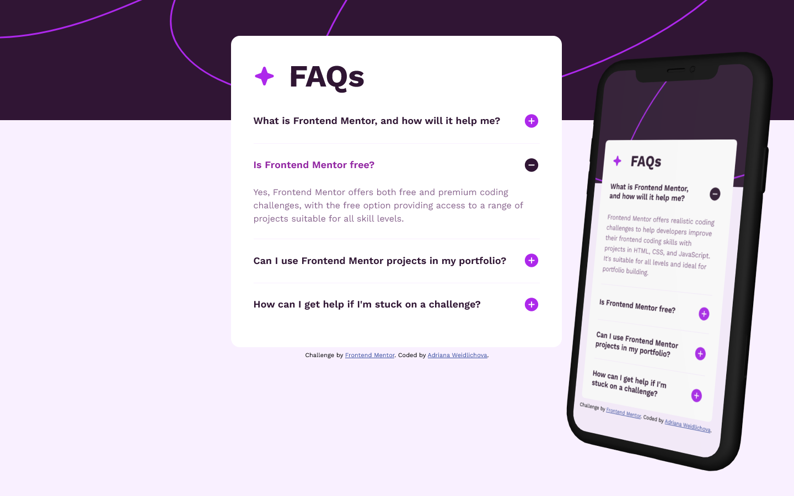

# Frontend Mentor - FAQ accordion solution

This is a solution to the [FAQ accordion challenge on Frontend Mentor](https://www.frontendmentor.io/challenges/faq-accordion-wyfFdeBwBz). Frontend Mentor challenges help you improve your coding skills by building realistic projects. 

## Table of contents

- [Frontend Mentor - FAQ accordion solution](#frontend-mentor---faq-accordion-solution)
  - [Table of contents](#table-of-contents)
  - [Overview](#overview)
    - [The challenge](#the-challenge)
    - [Screenshot](#screenshot)
    - [Links](#links)
  - [My process](#my-process)
    - [Built with](#built-with)
    - [What I learned](#what-i-learned)
    - [Continued development](#continued-development)
    - [Useful resources](#useful-resources)
    - [AI Collaboration](#ai-collaboration)
  - [Author](#author)
  - [Acknowledgments](#acknowledgments)

## Overview

### The challenge

Users should be able to:

- Hide/Show the answer to a question when the question is clicked
- Navigate the questions and hide/show answers using keyboard navigation alone
- View the optimal layout for the interface depending on their device's screen size
- See hover and focus states for all interactive elements on the page

### Screenshot



### Links

- Solution URL: [Github repository](https://github.com/Saliva-sys/Faq-Accordion.git)
- Live Site URL: [Live URL](https://saliva-sys.github.io/Faq-Accordion/)

## My process

### Built with

- Semantic HTML5 markup
- CSS custom properties
- Flexbox
- CSS Grid
- Mobile-first workflow
- [React](https://reactjs.org/) - JS library
- [Vite](https://vitejs.dev/) - Build tool


### What I learned

In this component, I focused on making the FAQ interactive using React state management. Here are the key takeaways:

*Dynamic Rendering with .map()*
Instead of repeating HTML structure for each FAQ item, I stored the data in an array of objects. This makes the code cleaner and easier to maintain, and follows the "DRY" (Don't Repeat Yourself) principle.
  
```js
{faqData.map((item) => (
  <article key={item.id} className="faq__area">
    {/* ... */}
  </article>
))}
```

*Stateful Accordion Logic*
I learned how to use the useState hook to track which item is currently open. By storing the ID of the active item (or null when all are closed), I ensured that only one question is expanded at a time.

*Conditional Rendering for Assets*
I practiced using the ternary operator to switch between plus and minus icons dynamically. I also learned that in a React environment (using Vite), images in the src folder should be imported as modules for proper bundling.

```js
<span className="faq__icon">
  
</span>
```

*Semantic HTML with <article>*
I used the <article> tag to wrap each question and answer pair, which improves the document structure and accessibility for screen readers. I used the ternary operator to switch between plus and minus icons dynamically and implemented aria-expanded to ensure the component is accessible to screen readers.

```js
<article key={item.id} className="faq__area">
  <button type='button' className="faq__button"
  onClick={() => handleToggle(item.id)}
  aria-expanded={openId === item.id}>
      <span className="faq__title">{item.title}</span>
      <span className="faq__icon">
          
      </span>
  </button>

  {openId === item.id && (
      <p className="faq__answer">{item.answer}</p>
  )}
  <hr className="faq__divider" />
</article>
```

### Continued development

- **Advanced Animations**: I want to explore more complex animations using libraries like Framer Motion to create smoother height transitions when the accordion opens and closes.
- **Accessibility (A11y)**: While I implemented `aria-expanded`, I want to learn more about `aria-controls` and keyboard focus management in more complex UI components.
- **Variable Fonts Optimization**: I'm interested in learning how to further optimize font loading to prevent Layout Shift (CLS) in larger applications.

### Useful resources

- [React Documentation](https://react.dev/) - The new docs are incredibly clear and helped me refine my understanding of Hooks and state updates.
- [Variable Fonts Guide (MDN)](https://developer.mozilla.org/en-US/docs/Web/CSS/Guides/Fonts/Variable_fonts) - This guide helped me understand how to implement the Work Sans variable font and control font weights dynamically.
- [BEM Methodology](https://getbem.com/) - Using BEM helped me keep my CSS organized and avoid naming conflicts, which is crucial for larger projects.
- [Clamp Generator](https://clampgenerator.com/) – This tool was essential for calculating fluid values for my layout, allowing the design to scale perfectly between mobile and desktop.
- [CSS Flexbox Layout Guide](https://css-tricks.com/snippets/css/a-guide-to-flexbox/) – This is my go-to reference for Flexbox. It helped me perfectly align the icons and headings within the accordion buttons.

### AI Collaboration

This project was a great exercise in working with an AI assistant (Gemini 3 Flash).

- **Technical Brainstorming**: I used Gemini as a sparring partner to brainstorm layout solutions and debug complex CSS behaviors, specifically regarding the interaction between variable fonts and layout spacing.
- **Problem Solving**: AI helped me identify and fix the "hidden" browser-default styles for buttons and helped me refine my clamp() calculations.
- **Workflow**: Gemini assisted in organizing the CSS architecture and ensuring the project structure was clean and professional.

## Author

- Frontend Mentor - [@Saliva-sys](https://www.frontendmentor.io/profile/Saliva-sys)
- GitHub - [Saliva-sys](https://github.com/Saliva-sys)

## Acknowledgments

I would like to thank the Frontend Mentor community for providing such great challenges to practice real-world web development skills.